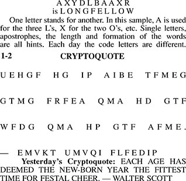

# Cryptoqote

A web app for solving cryptoquote puzzes like this one.

<div style="text-align:center"></img></div>

Ready to play? Visit the [web app here](https://calaway.github.io/cryptoquote/). Here is a sample puzzle you can work on.

```
EJWB ZDBPWN PSDH’R SDPWWT
ZPBD JC EJWB. RGDT’SD ZPBD
JC NFDPR, BDRDSZYHPRYJH,
PHB P GPSB-RJ-CYHB PWWJT
QPWWDB EKRN. — BPH EPIWD
```

<details>
    <summary>Stumped? Need a hint?</summary>
    The first two words are "gold medals."
</details>
